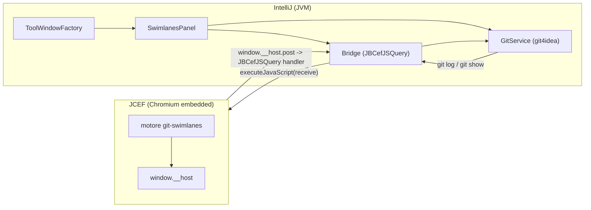
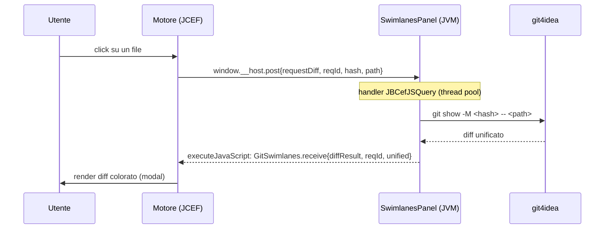

# Git Swimlanes — Specifica plugin **IntelliJ Platform**

Specifica esaustiva per incapsulare il visualizzatore deterministico della history Git
(motore `git-swimlanes.html`, vedi `git-swimlanes-spec.md`) in un plugin IntelliJ
(IDEA, PyCharm, WebStorm, ecc.) tramite **JCEF**.

> **Separazione delle responsabilità.** Il motore (parsing, corsie, colori, SVG, accordion,
> diff viewer) gira invariato dentro la webview JCEF. Il plugin è il **guscio host**: crea la
> tool window con il browser, fornisce i dati Git e risponde alle richieste di diff.
> Identico contratto di messaggi della spec VS Code: cambia solo il trasporto.

---

## 1. Architettura



- Il browser è un **JCEF** (`JBCefBrowser`). JCEF è il framework Chromium embedded di JetBrains,
  disponibile dalla 2020.1; **verificare `JBCefApp.isSupported()`** a runtime e impostare un
  `since-build` adeguato.
- JS→Java è **asincrono** via `JBCefJSQuery` (non c'è accesso diretto al DOM da Java).
- Java→JS avviene con `executeJavaScript(...)`.

---

## 2. Contratto di messaggi (host ↔ webview)

Identico alla spec VS Code — un solo protocollo.

```ts
// Webview -> Host
type Wv2Host =
  | { type: "ready" }
  | { type: "requestDiff"; reqId: string; hash: string; path: string; oldPath?: string }
  | { type: "commitSelected"; hash: string }
  | { type: "openFile"; path: string; hash: string };

// Host -> Webview
type Host2Wv =
  | { type: "setLog"; log: string }
  | { type: "diffResult"; reqId: string; unified: string }
  | { type: "diffError"; reqId: string; message: string }
  | { type: "theme"; theme: { laneSaturation: number; laneLightness: number } };
```

Superficie del motore nella webview (uguale ovunque):

```ts
window.__host = { post(msg: Wv2Host): void };   // installata dall'host
window.GitSwimlanes.receive(msg: Host2Wv): void; // invocata dall'host
```

---

## 3. Scaffold del progetto

```
git-swimlanes-intellij/
├── build.gradle.kts
├── src/main/
│   ├── kotlin/com/acme/swimlanes/
│   │   ├── SwimlanesToolWindowFactory.kt
│   │   ├── SwimlanesPanel.kt        # JCEF + bridge + router
│   │   ├── GitService.kt            # git4idea: log/show
│   │   └── Json.kt                  # serializzazione messaggi
│   └── resources/
│       ├── META-INF/plugin.xml
│       └── web/                     # engine.js, engine.css, index.html
```

### 3.1 `plugin.xml`

```xml
<idea-plugin>
  <id>com.acme.git-swimlanes</id>
  <name>Git Swimlanes</name>
  <vendor>Acme</vendor>

  <depends>com.intellij.modules.platform</depends>
  <depends>Git4Idea</depends>

  <idea-version since-build="233"/> <!-- adattare al minimo supportato con JCEF -->

  <extensions defaultExtensionNs="com.intellij">
    <toolWindow id="Git Swimlanes"
                anchor="bottom"
                icon="AllIcons.Vcs.Branch"
                factoryClass="com.acme.swimlanes.SwimlanesToolWindowFactory"/>
  </extensions>
</idea-plugin>
```

### 3.2 `build.gradle.kts` (estratto)

```kotlin
plugins {
  kotlin("jvm") version "1.9.+"
  id("org.jetbrains.intellij.platform") version "2.+"   // adattare alla versione in uso
}
repositories { mavenCentral(); intellijPlatform { defaultRepositories() } }
dependencies {
  intellijPlatform {
    intellijIdeaCommunity("2024.1")
    bundledPlugin("Git4Idea")
  }
}
```

---

## 4. Hosting JCEF

### 4.1 Tool window factory

```kotlin
class SwimlanesToolWindowFactory : ToolWindowFactory, DumbAware {
  override fun createToolWindowContent(project: Project, toolWindow: ToolWindow) {
    val panel = SwimlanesPanel(project, toolWindow.disposable)
    val content = ContentFactory.getInstance()
      .createContent(panel.component, "", false)
    toolWindow.contentManager.addContent(content)
  }

  override fun isApplicable(project: Project) = JBCefApp.isSupported()
}
```

### 4.2 Pannello: browser + ponte + router

```kotlin
class SwimlanesPanel(private val project: Project, parent: Disposable) {
  private val git = GitService(project)
  private val browser = JBCefBrowser()
  private val query = JBCefJSQuery.create(browser as JBCefBrowserBase)
  val component get() = browser.component

  init {
    Disposer.register(parent, browser)
    Disposer.register(parent, query)

    // JS -> Java: il motore chiama window.__host.post(msg); arriva qui come stringa JSON.
    query.addHandler { request ->
      handleFromWebview(request)
      null                         // risposta asincrona via push (vedi postToWebview)
    }

    // Inietta il ponte appena la pagina è caricata, poi avvia il refresh.
    browser.jbCefClient.addLoadHandler(object : CefLoadHandlerAdapter() {
      override fun onLoadEnd(b: CefBrowser, f: CefFrame, code: Int) {
        if (!f.isMain) return
        browser.cefBrowser.executeJavaScript(
          """
          window.__host = { post: function(msg) { ${query.inject("JSON.stringify(msg)")} } };
          if (window.GitSwimlanes && window.GitSwimlanes.onReady) window.GitSwimlanes.onReady();
          """.trimIndent(),
          browser.cefBrowser.url, 0
        )
      }
    }, browser.cefBrowser)

    // Carica il motore (HTML self-contained dalle risorse del plugin).
    browser.loadHTML(loadResource("/web/index.html"))

    subscribeRepoChanges(parent)
  }

  /** Java -> JS: consegna un messaggio al motore. */
  private fun postToWebview(msg: Any) {
    val json = Json.encode(msg)
    val esc = json.replace("\\", "\\\\").replace("'", "\\'")
                  .replace("\n", "\\n").replace("\r", "")
    browser.cefBrowser.executeJavaScript(
      "window.GitSwimlanes && window.GitSwimlanes.receive(JSON.parse('$esc'));",
      browser.cefBrowser.url, 0
    )
  }

  private fun handleFromWebview(request: String) {
    val msg = Json.decode(request)
    when (msg.type) {
      "ready" -> refresh()
      "requestDiff" -> runOnPooled {
        try {
          val unified = git.show(msg.hash!!, msg.path!!)
          invokeLater { postToWebview(mapOf(
            "type" to "diffResult", "reqId" to msg.reqId, "unified" to unified)) }
        } catch (e: Exception) {
          invokeLater { postToWebview(mapOf(
            "type" to "diffError", "reqId" to msg.reqId, "message" to e.message)) }
        }
      }
      "openFile" -> invokeLater { openInEditor(msg.path!!) }
    }
  }

  fun refresh() = runOnPooled {
    val log = git.log()
    val dark = !JBColor.isBright()
    invokeLater {
      postToWebview(mapOf("type" to "setLog", "log" to log))
      postToWebview(mapOf("type" to "theme",
        "theme" to mapOf("laneSaturation" to 68, "laneLightness" to if (dark) 60 else 45)))
    }
  }
}
```

> **Threading.** `git` non va mai eseguito sull'EDT: usare `executeOnPooledThread`
> (`runOnPooled`) e tornare sull'EDT con `invokeLater` per parlare al browser.

---

## 5. GitService — git4idea

```kotlin
class GitService(private val project: Project) {

  private fun repoRoot(): VirtualFile =
    GitRepositoryManager.getInstance(project).repositories.firstOrNull()?.root
      ?: throw IllegalStateException("Nessun repository Git nel progetto")

  fun log(): String {
    val h = GitLineHandler(project, repoRoot(), GitCommand.LOG).apply {
      addParameters(
        "--all", "--date-order", "--name-status",
        "--pretty=format:%H|%P|%D|%an|%ad|%s", "--date=short"
      )
    }
    val r = Git.getInstance().runCommand(h)
    if (!r.success()) throw IllegalStateException(r.errorOutputAsJoinedString)
    return r.outputAsJoinedString
  }

  fun show(hash: String, path: String): String {
    require(hash.matches(Regex("^[0-9a-f]{7,40}$"))) { "hash non valido" }
    val h = GitLineHandler(project, repoRoot(), GitCommand.SHOW).apply {
      addParameters("-M", hash, "--", path)
    }
    val r = Git.getInstance().runCommand(h)
    if (!r.success()) throw IllegalStateException(r.errorOutputAsJoinedString)
    return r.outputAsJoinedString
  }
}
```

> **Nota su `core.quotepath`.** `GitLineHandler` aggiunge i parametri **dopo** il comando,
> mentre `-c core.quotepath=false` è un'opzione top-level di `git`. Se i path con accenti
> risultano quotati, due opzioni: (a) eseguire `git` con `GeneralCommandLine` (controllo
> totale degli argomenti, vedi appendice); (b) normalizzare lato motore. `git4idea` è API
> semi-interna e può cambiare tra versioni: **verificare** firme e `outputAsJoinedString`
> contro la piattaforma target.

### 5.1 Refresh automatico

```kotlin
private fun subscribeRepoChanges(parent: Disposable) {
  project.messageBus.connect(parent).subscribe(
    GitRepository.GIT_REPO_CHANGE,
    GitRepositoryChangeListener { refresh() }
  )
}
```

---

## 6. Diff on-click — sequenza completa



Il viewer del motore (modal con `add/del/hunk/meta`) è già pronto: l'host restituisce solo
`unified`. Il `reqId` correla risposte asincrone fuori ordine.

---

## 7. Tema — sincronia con l'IDE

JCEF non eredita il tema: va spinto. Due livelli:

1. **Chiaro/scuro per le corsie**: in `refresh()` si calcola `laneLightness` da
   `JBColor.isBright()` e si invia il messaggio `theme`.
2. **Token CSS di base** (sfondo/testo/bordo): leggere i colori IDE e iniettarli come CSS
   variables:

   ```kotlin
   fun pushBaseTheme() {
     fun hex(c: java.awt.Color) = "#%02x%02x%02x".format(c.red, c.green, c.blue)
     val bg   = hex(UIUtil.getPanelBackground())
     val txt  = hex(UIUtil.getLabelForeground())
     val line = hex(JBColor.border())
     browser.cefBrowser.executeJavaScript(
       """
       const r = document.documentElement.style;
       r.setProperty('--bg','$bg'); r.setProperty('--txt','$txt'); r.setProperty('--line','$line');
       """.trimIndent(), browser.cefBrowser.url, 0)
   }
   ```

   Richiamare anche su cambio tema (`LafManagerListener` / `EditorColorsListener`).

> Gli scrollbar JCEF possono essere allineati all'IDE con `JBCefScrollbarsHelper`.

---

## 8. Lifecycle e disposizione

- `JBCefBrowser`, `JBCefClient`, `JBCefJSQuery` implementano `Disposable`:
  **registrarli con un parent `Disposable`** (qui `toolWindow.disposable`) per il cleanup.
- Gli handler registrati su un `JBCefClient` custom vanno rimossi nel `dispose()`.
- Un solo `JBCefJSQuery` per pannello; non crearne nel ciclo di rendering.

---

## 9. Packaging e pubblicazione

```bash
./gradlew buildPlugin     # produce build/distributions/git-swimlanes-x.y.z.zip
./gradlew runIde          # IDE sandbox per test
./gradlew verifyPlugin    # Plugin Verifier: compatibilità tra build
./gradlew publishPlugin   # JetBrains Marketplace (richiede token)
```

Dichiarare la compatibilità (`since-build`/`until-build`) coerente con la disponibilità JCEF
sui prodotti target. Inserire i bundle del motore (`engine.js`, `engine.css`, `index.html`)
sotto `src/main/resources/web/`.

---

## 10. Casi limite

| Caso | Comportamento |
|---|---|
| `JBCefApp.isSupported()` = false (IDE senza JCEF) | tool window non applicabile; messaggio di fallback |
| Più repository nel progetto | selettore di repo o una scheda per repo |
| Repo shallow | archi verso parent assenti omessi; suggerire `git fetch --unshallow` |
| Diff binario | `git show` segnala "Binary files differ"; mostrato come testo |
| Merge senza file | comportamento Git standard; hint `-m --first-parent` nel motore |
| `git4idea` cambia API tra versioni | isolare in `GitService`; fallback `GeneralCommandLine` |

---

## 11. Appendice — `git` con `GeneralCommandLine` (controllo totale)

Alternativa a `git4idea` quando servono opzioni top-level (es. `-c core.quotepath=false`):

```kotlin
fun rawGit(root: String, args: List<String>): String {
  val cmd = GeneralCommandLine(listOf("git") + args)
    .withWorkDirectory(root)
    .withCharset(Charsets.UTF_8)
  val out = ExecUtil.execAndGetOutput(cmd)
  if (out.exitCode != 0) throw IllegalStateException(out.stderr)
  return out.stdout
}

// log:
rawGit(root, listOf("-c","core.quotepath=false","--no-pager","log","--all","--date-order",
  "--name-status","--pretty=format:%H|%P|%D|%an|%ad|%s","--date=short"))
// diff:
rawGit(root, listOf("show","-M",hash,"--",path))   // validare prima 'hash'
```

> Comandi Git di riferimento (log, show, shallow check, diff dei merge): vedi
> `git-swimlanes-spec.md` §11. Modello dati e algoritmi del motore: stessa spec.
