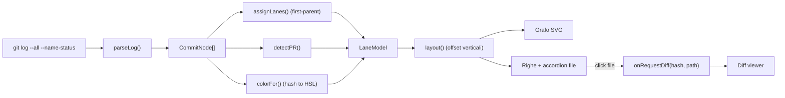
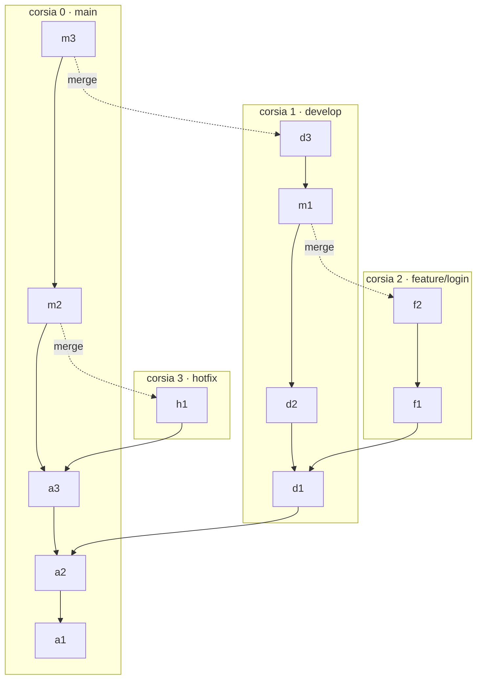
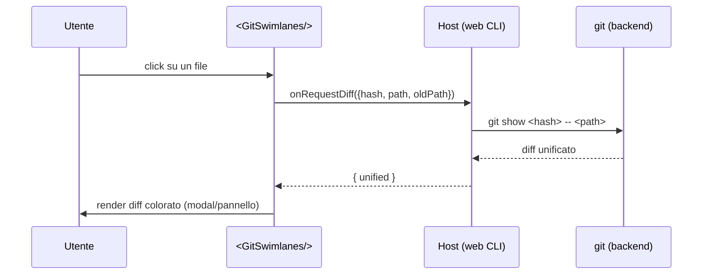
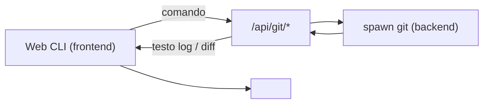

# Git Swimlanes — Specifica funzionale e di integrazione

Visualizzatore deterministico della history di un repository Git, pensato per essere
incorporato come componente React in una web CLI. Questo documento è la specifica
completa: modello dati, algoritmi, contratti di rendering, API del componente,
aggancio del diff e note di integrazione.

> Riferimento d'implementazione: `git-swimlanes.html` (prototipo vanilla autoconsistente).
> Questo documento ne formalizza il comportamento e ne descrive il porting a React/TypeScript.

---

## 1. Scopo e principi di progetto

Il componente risolve due difetti ricorrenti dei plugin di history Git:

1. **Colori non deterministici** dei rami. → Qui il colore è una **funzione pura del nome del branch** (`hash(nome) → tonalità HSL`). Lo stesso ramo ha sempre lo stesso colore, in qualunque repo e a ogni render.
2. **Colonne non etichettate.** → Ogni corsia (colonna) è **stabile** e ha un'**etichetta persistente** con il nome del ramo.

Principi invarianti che ogni implementazione deve preservare:

- **Determinismo**: dato lo stesso input, l'output (corsie, colori, posizioni) è identico. Nessuna scelta dipendente dall'ordine di scoperta o dal tempo.
- **Una PR non è un oggetto Git**: viene *inferita* dai messaggi di commit; mai presentata come verità assoluta.
- **Onestà topologica**: ciò che Git non sa (a quale ramo appartiene un commit storico) non viene inventato; si usa l'euristica standard del *first-parent* e si segnala il caso di fallback.
- **Allineamento**: il grafo (SVG) e le righe (HTML) condividono lo stesso sistema di offset verticali; qualsiasi espansione (accordion) ricalcola gli offset.

---

## 2. Modello dati

### 2.1 Input

L'input primario è l'output testuale di:

```bash
git -c core.quotepath=false --no-pager log --all --date-order --name-status \
  --pretty=format:"%H|%P|%D|%an|%ad|%s" --date=short
```

Formato per commit: una **riga header** `hash|parents|refs|author|date|subject`,
seguita (con `--name-status`) da zero o più **righe file** `STATUS\tpath`
(per rename/copy: `R100\told\tnew`).

### 2.2 Tipi TypeScript

```ts
/** Stato di un file in un commit (codici git --name-status). */
export type FileStatusCode =
  | "A" | "M" | "D" | "T" | "U" | "B"
  | `R${number}` | `C${number}`;   // rename/copy con punteggio di similarità

export interface FileChange {
  code: FileStatusCode;   // "A", "M", "R100", ...
  path: string;           // path nuovo (o unico)
  old?: string;           // path precedente, solo per R/C
}

/** Commit dopo il parsing — nodo del DAG. */
export interface CommitNode {
  hash: string;
  parents: string[];      // parents[0] = first-parent
  author: string;
  date: string;           // ISO short (es. "2024-01-18")
  subject: string;
  branches: string[];     // ref di tipo branch presenti sul commit (solo sui tip)
  tags: string[];
  head: boolean;          // true se HEAD punta qui
  files: FileChange[];
}

/** Risultato del calcolo topologico (indipendente dall'espansione UI). */
export interface LaneModel {
  commits: CommitNode[];                 // in ordine di visualizzazione (newest first)
  byHash: Record<string, CommitNode>;
  laneOf: Record<string, number>;        // hash -> indice colonna
  branchOf: Record<string, string>;      // hash -> nome ramo proprietario
  laneNames: string[];                   // nome ramo per indice colonna
  nLanes: number;
  rowOf: Record<string, number>;         // hash -> indice riga
  graphW: number;                        // larghezza area grafo (px)
}

/** Richiesta/risposta diff (vedi §5.3). */
export interface DiffRequest { hash: string; path: string; oldPath?: string; }
export interface DiffResult  { unified: string; }   // testo diff unificato

/** Una PR inferita dal messaggio. */
export interface PullRequestRef {
  id: string;
  src: "Azure DevOps" | "GitHub" | "GitLab" | "Bitbucket" | "squash";
}
```

### 2.3 Costanti di layout

```ts
export const LAYOUT = {
  LP: 16,        // padding sinistro grafo
  laneW: 28,     // larghezza colonna
  RP: 10,        // padding destro
  rowH: 46,      // altezza riga commit
  dotR: 6,       // raggio nodo normale
  mergeR: 7.5,   // raggio nodo merge
} as const;

export const laneX = (i: number) => LAYOUT.LP + i * LAYOUT.laneW + LAYOUT.laneW / 2;
```

---

## 3. Pipeline di elaborazione



`parseLog` e `assignLanes` girano **una volta** per input. `layout` gira a **ogni
toggle** di accordion (dipende dallo stato di espansione). `onRequestDiff` è
**asincrono** e demandato all'host.

---

## 4. Algoritmi

### 4.1 Parsing del log

Distinzione delle righe (l'ordine dei controlli conta):

1. **riga file**: matcha `^[ACDMRTUXB]\d*\t` → appartiene al commit corrente;
2. altrimenti **riga header**: contiene `|`;
3. altrimenti ignorata (righe vuote, separatori).

Gli hash Git sono esadecimali minuscoli, quindi non collidono mai con `^[A-Z]`:
nessun separatore/sentinella è necessario.

```ts
export function parseLog(text: string): { commits: CommitNode[]; byHash: Record<string, CommitNode> } {
  const commits: CommitNode[] = [];
  const byHash: Record<string, CommitNode> = {};
  let current: CommitNode | null = null;

  for (const raw of text.replace(/\r/g, "").split("\n")) {
    if (!raw.trim()) continue;

    // (1) riga file
    if (/^[ACDMRTUXB]\d*\t/.test(raw)) {
      if (!current) continue;
      const p = raw.split("\t");
      const code = p[0] as FileStatusCode;
      current.files.push(
        code[0] === "R" || code[0] === "C"
          ? { code, old: p[1], path: p[2] ?? p[1] }
          : { code, path: p[1] }
      );
      continue;
    }
    if (!raw.includes("|")) continue;

    // (2) header
    const [hash, parents = "", refs = "", author = "", date = "", ...rest] = raw.split("|");
    const c: CommitNode = {
      hash: hash.trim(),
      parents: parents.trim() ? parents.trim().split(/\s+/) : [],
      author: author.trim(),
      date: date.trim(),
      subject: rest.join("|").trim(),
      branches: [], tags: [], head: false, files: [],
    };
    for (let r of refs.split(",")) {
      r = r.trim(); if (!r) continue;
      if (r.startsWith("tag: ")) c.tags.push(r.slice(5).trim());
      else if (r.includes("HEAD -> ")) { c.head = true; c.branches.push(r.split("->")[1].trim()); }
      else if (r === "HEAD") c.head = true;
      else c.branches.push(r);
    }
    commits.push(c); byHash[c.hash] = c; current = c;
  }
  return { commits, byHash };
}
```

### 4.2 Colore deterministico

```ts
export function hueFromName(name: string): number {
  let h = 0;
  for (const ch of name) h = (h * 31 + ch.charCodeAt(0)) >>> 0;
  return h % 360;
}

export function colorFor(name: string): string {
  if (name === "(no branch ref)") return "hsl(215 10% 50%)";
  return `hsl(${hueFromName(name)} 68% 60%)`;   // S/L fissi → leggibilità costante
}
```

Saturazione e luminosità fissi garantiscono contrasto uniforme; varia solo la tonalità.
Sostituibile con qualsiasi mappa `nome → colore` purché resti **pura e iniettiva a sufficienza**.

### 4.3 Assegnazione delle corsie (first-parent swimlanes)

L'idea: ogni ramo **reclama** una colonna risalendo la catena del *first-parent*
dal proprio tip. La priorità di assegnazione è deterministica.

```ts
function priority(name: string): [number, string] {
  if (name === "main" || name === "master") return [0, name];
  if (name === "develop" || name === "dev")  return [1, name];
  return [2, name];
}

export function assignLanes(
  commits: CommitNode[],
  byHash: Record<string, CommitNode>
): LaneModel {
  // 1. tip dei branch, dedup remote/locale per nome base (preferisci locale)
  const tips: Record<string, { name: string; tip: string; remote: boolean }> = {};
  for (const c of commits)
    for (const b of c.branches) {
      const norm = b.replace(/^origin\//, "");
      if (!(norm in tips)) tips[norm] = { name: norm, tip: c.hash, remote: b !== norm };
      else if (tips[norm].remote && b === norm) tips[norm] = { name: norm, tip: c.hash, remote: false };
    }

  // 2. ordine deterministico: main, develop, poi alfabetico
  const branches = Object.values(tips).sort((a, b) => {
    const pa = priority(a.name), pb = priority(b.name);
    return pa[0] - pb[0] || pa[1].localeCompare(pb[1]);
  });

  // 3. claim per first-parent, in ordine di priorità
  const laneOf: Record<string, number> = {};
  const branchOf: Record<string, string> = {};
  branches.forEach((b, lane) => {
    let cur: string | undefined = b.tip;
    while (cur && byHash[cur] && laneOf[cur] === undefined) {
      laneOf[cur] = lane;
      branchOf[cur] = b.name;
      cur = byHash[cur].parents[0];   // first-parent
    }
  });

  // 4. fallback: commit raggiunti da nessun ref (branch mergeato e cancellato)
  let extra: number | null = null;
  for (const c of commits)
    if (laneOf[c.hash] === undefined) {
      if (extra === null) extra = branches.length;
      laneOf[c.hash] = extra; branchOf[c.hash] = "(no branch ref)";
    }

  const laneNames = branches.map(b => b.name);
  if (extra !== null) laneNames.push("(no branch ref)");

  const rowOf: Record<string, number> = {};
  commits.forEach((c, i) => (rowOf[c.hash] = i));

  return {
    commits, byHash, laneOf, branchOf, laneNames,
    nLanes: laneNames.length, rowOf,
    graphW: LAYOUT.LP + laneNames.length * LAYOUT.laneW + LAYOUT.RP,
  };
}
```

**Perché funziona.** Quando si fa *merge di `feature` in `main`*, il merge commit ha come
first-parent il vecchio tip di `main` (convenzione Git). Quindi la risalita first-parent di
`main` resta su `main`, e i commit di `feature` restano nella loro colonna. Risultato: corsie
stabili. Esempio sul repo di prova:



> **Caso di fallback.** Un branch già **mergeato e poi cancellato** non ha più un ref che
> reclami i suoi commit via first-parent: quei commit finiscono nella colonna
> `(no branch ref)`. È un limite reale del modello Git, non un bug. Per ricostruirli serve
> l'API della forge.

### 4.4 Rilevamento delle PR

Una PR non esiste in Git: la si infersce dal messaggio. Tabella dei pattern per forge:

| Forge | Strategia | Pattern (subject) | Esempio |
|---|---|---|---|
| Azure DevOps | merge / squash | `^Merged PR (\d+):` | `Merged PR 1042: ...` |
| GitHub | merge | `Merge pull request #(\d+)` | `Merge pull request #42 from ...` |
| GitHub/GitLab | squash | `\(#(\d+)\)\s*$` | `Add login (#42)` |
| GitLab | merge | `merge request[^!]*!(\d+)` | `... See merge request g/p!42` |
| Bitbucket | merge | `\bpull request #(\d+)` | `Merged in x (pull request #42)` |

```ts
export function detectPR(subject: string): PullRequestRef | null {
  let m: RegExpMatchArray | null;
  if ((m = subject.match(/^Merged PR (\d+)/i)))           return { id: m[1], src: "Azure DevOps" };
  if ((m = subject.match(/Merge pull request #(\d+)/i)))  return { id: m[1], src: "GitHub" };
  if ((m = subject.match(/\bpull request #(\d+)/i)))      return { id: m[1], src: "Bitbucket" };
  if ((m = subject.match(/merge request[^!]*!(\d+)/i)))   return { id: m[1], src: "GitLab" };
  if ((m = subject.match(/\(#(\d+)\)\s*$/)))              return { id: m[1], src: "squash" };
  return null;
}
```

> **Rebase.** Se le PR sono completate in rebase, non resta alcuna traccia nel messaggio né
> nella topologia: il rilevamento da `git log` è impossibile. Unica fonte: l'API della forge.

### 4.5 Layout verticale dinamico

Il grafo SVG e le righe HTML sono colonne affiancate allineate riga-per-riga. Un accordion
aperto aumenta l'altezza della riga: per non rompere l'allineamento si **ricalcolano gli
offset** e l'SVG si allunga, lasciando un vuoto sotto al nodo.

```ts
const PANEL = { lineH: 24, padV: 18, cap: 250 };

export function panelHeight(c: CommitNode): number {
  const n = Math.max(c.files.length, 1);
  return Math.min(PANEL.padV + n * PANEL.lineH, PANEL.cap);
}

/** Offset verticali dato lo stato di espansione. */
export function computeOffsets(m: LaneModel, expanded: Set<string>) {
  const top: number[] = [];
  let y = 0;
  for (const c of m.commits) {
    top.push(y);
    y += LAYOUT.rowH + (expanded.has(c.hash) ? panelHeight(c) : 0);
  }
  const dotY = (i: number) => top[i] + LAYOUT.rowH / 2;
  return { top, totalH: y, dotY };
}
```

Struttura DOM di una riga (altezza deterministica → offset esatti):

```
┌─ .cwrap  (height = rowH + panelHeight?) ───────────────┐
│ ┌─ .crow  (height = rowH) ─────────────────────────────┐│   ← nodo @ top + rowH/2
│ │ ▸  hash   [PR][branch][tag]   subject      ⊞n   who  ││
│ └──────────────────────────────────────────────────────┘│
│ ┌─ .files (height = panelHeight, solo se aperto) ───────┐│
│ │ [M] path/file.java ............................ diff ›││   ← click → diff
│ └──────────────────────────────────────────────────────┘│
└──────────────────────────────────────────────────────────┘
```

---

## 5. Rendering

### 5.1 Grafo SVG

Per ogni commit `c` al centro `(laneX(laneOf[c]), dotY(rowOf[c]))`:

- **Guide di corsia**: linea verticale a tutta altezza in `laneX(i)`, colore ramo, `opacity 0.07`.
- **Archi** verso ogni parent `p`:
  - stessa corsia → segmento verticale;
  - corsie diverse → cubica `M cx cy C cx my, px my, px py` con `my = (cy+py)/2`;
  - **colore**: first-parent → colore del *figlio* (continuità/nascita ramo); altri parent → colore del *parent* (merge).
- **Nodo**:
  - normale → cerchio pieno `r = dotR`;
  - merge (≥2 parent) → ciambella (cerchio pieno + foro colore sfondo);
  - PR rilevata → alone `r = 11`, `stroke #7b93ff`.

```ts
function edgePath(cx:number,cy:number,px:number,py:number){
  if (cx === px) return `<line x1="${cx}" y1="${cy}" x2="${px}" y2="${py}" stroke-width="2"/>`;
  const my = (cy + py) / 2;
  return `<path d="M ${cx} ${cy} C ${cx} ${my}, ${px} ${my}, ${px} ${py}" fill="none" stroke-width="2"/>`;
}
```

### 5.2 Righe e accordion file

Ogni `.crow` espone `data-hash`; ogni `.frow` espone `data-hash` + `data-path`.
Delegazione eventi: `closest(".frow")` prima di `closest(".crow")` (i file non
sono dentro `.crow`, quindi non innescano il toggle del commit).

Codici file → colore/etichetta:

| Code | Etichetta | Colore |
|---|---|---|
| `A` | aggiunto | `#5fc77f` |
| `M` | modificato | `#e8b04b` |
| `D` | eliminato | `#e06c75` |
| `R…` | rinominato (`old → new`) | `#b48ead` |
| `C…` | copiato | `#56b6c2` |
| `T` | cambio tipo | `#8a96a8` |

### 5.3 Diff viewer — il contratto chiave per l'integrazione

Il componente **non** legge il filesystem: chiede il diff all'host tramite callback
asincrona. Questo lo rende usabile in browser (web CLI) dove il git gira su un backend.

```ts
type RequestDiff = (req: DiffRequest) => Promise<DiffResult>;
```

Sequenza:



Comando lato host:

```bash
git show <hash> -- <path>
# rinominati: passa anche oldPath, oppure usa -M
git show -M <hash> -- <oldPath> <path>
```

Classificazione delle righe del diff per il rendering:

```ts
export function classifyDiffLine(l: string):
  "hunk" | "meta" | "add" | "del" | "ctx" {
  if (l.startsWith("@@")) return "hunk";
  if (/^(\+\+\+|---|diff |index |new file|deleted file|similarity|rename )/.test(l)) return "meta";
  if (l.startsWith("+")) return "add";
  if (l.startsWith("-")) return "del";
  return "ctx";
}
```

Stili consigliati: `add` su sfondo verde tenue, `del` rosso tenue, `hunk` azzurro,
`meta` attenuato; corpo in `white-space: pre`.

---

## 6. API del componente React

### 6.1 Props

```ts
export interface SwimlanesOptions {
  newestFirst?: boolean;        // default true (ordine git log)
  showLaneGuides?: boolean;     // default true
  detectPullRequests?: boolean; // default true
  multiExpand?: boolean;        // default true (più accordion aperti)
}

export interface GitSwimlanesProps {
  /** Una delle due fonti dati: testo grezzo OPPURE commit pre-parsati. */
  log?: string;
  commits?: CommitNode[];

  options?: SwimlanesOptions;
  theme?: Partial<Theme>;       // override CSS variables (vedi §8)

  /** Eventi. */
  onCommitToggle?(hash: string, expanded: boolean): void;
  onCommitSelect?(commit: CommitNode): void;
  onFileSelect?(req: DiffRequest): void;

  /** Caricamento diff asincrono. Se assente, il file mostra il contratto come hint. */
  onRequestDiff?(req: DiffRequest): Promise<DiffResult>;

  /** Resa diff personalizzata (override del viewer integrato). */
  renderDiff?(result: DiffResult, req: DiffRequest): React.ReactNode;
}

export interface SwimlanesHandle {
  expand(hash: string): void;
  collapse(hash: string): void;
  collapseAll(): void;
  scrollToCommit(hash: string): void;
}
```

### 6.2 Esempio d'uso

```tsx
import { useMemo, useRef } from "react";
import { GitSwimlanes, parseLog, assignLanes, SwimlanesHandle } from "@yourorg/git-swimlanes";

export function HistoryPanel({ rawLog }: { rawLog: string }) {
  const ref = useRef<SwimlanesHandle>(null);

  // Parsing memoizzato: gira solo quando cambia il log.
  const commits = useMemo(() => parseLog(rawLog).commits, [rawLog]);

  // Diff on-demand: chiamata al backend della web CLI.
  const requestDiff = async ({ hash, path }: DiffRequest): Promise<DiffResult> => {
    const res = await fetch(`/api/git/diff?hash=${hash}&path=${encodeURIComponent(path)}`);
    if (!res.ok) throw new Error(`diff ${hash}:${path} -> ${res.status}`);
    return { unified: await res.text() };
  };

  return (
    <GitSwimlanes
      ref={ref}
      commits={commits}
      options={{ multiExpand: true }}
      onRequestDiff={requestDiff}
      onCommitSelect={(c) => console.log("selected", c.hash)}
    />
  );
}
```

### 6.3 Note di implementazione React

- **Stato di espansione**: `useState<Set<string>>`; il toggle ricalcola gli offset (§4.5) e ri-renderizza SVG + righe. Memoizzare `LaneModel` con `useMemo([commits])`.
- **Diff asincrono**: stato per-richiesta `{loading | error | result}`; mostrare skeleton durante l'attesa, gestire l'errore (es. file binario, hash assente).
- **SVG**: generare path come stringhe e iniettare via `dangerouslySetInnerHTML` su un `<svg>`, oppure mappare a elementi React (`<line>`, `<path>`, `<circle>`). Per repo grandi preferire la stringa (meno nodi React).
- **Niente `localStorage`/storage del browser** se il target è un artifact sandbox; usare stato in memoria.

---

## 7. Integrazione nella web CLI

### 7.1 Fonte dati



Endpoint minimi consigliati:

| Endpoint | git sottostante | Risposta |
|---|---|---|
| `GET /api/git/log` | `git log --all --name-status --pretty=...` | `text/plain` (formato §2.1) |
| `GET /api/git/diff?hash&path` | `git show <hash> -- <path>` | `text/plain` (diff unificato) |
| `GET /api/git/pr-refs` *(opz.)* | `git fetch origin "+refs/pull/*"` poi `git log` | ref PR come branch |

Esempio backend (Node, lettura sola, **sanitizzazione obbligatoria** di `hash`/`path`):

```ts
import { execFile } from "node:child_process";
import { promisify } from "node:util";
const run = promisify(execFile);

app.get("/api/git/diff", async (req, res) => {
  const hash = String(req.query.hash ?? "");
  const path = String(req.query.path ?? "");
  if (!/^[0-9a-f]{7,40}$/.test(hash)) return res.status(400).end("bad hash");
  // path passato come argomento separato dopo "--": niente shell injection
  const { stdout } = await run("git", ["show", hash, "--", path], {
    cwd: REPO_DIR, maxBuffer: 16 * 1024 * 1024,
  });
  res.type("text/plain").send(stdout);
});
```

> **Sicurezza**: non concatenare mai input utente in una shell. Usare `execFile`
> (niente shell), validare l'hash con regex, passare il path dopo `--`. Limitare la
> dimensione del buffer per i diff giganti.

### 7.2 Recupero affidabile delle PR (opzionale)

I ref delle PR non arrivano col clone normale. Per renderle corsie a tutti gli effetti:

```bash
# GitHub
git fetch origin "+refs/pull/*/head:refs/remotes/origin/pr/*"
# Azure DevOps (verificare il namespace per versione/configurazione del server)
git fetch origin "+refs/pull/*/merge:refs/remotes/origin/pr/*"
# GitLab
git fetch origin "+refs/merge-requests/*/head:refs/remotes/origin/mr/*"
```

Dopo il fetch, i `pr/<id>` compaiono come branch nel `%D` e quindi come corsie etichettate.

---

## 8. Tema e accessibilità

Override via CSS variables:

```css
:root {
  --bg: #0d1117; --panel: #11161f; --panel2: #0a0e14; --line: #222b38;
  --txt: #c9d4e3; --dim: #6f7d92; --accent: #e8b04b;
}
```

```ts
export interface Theme {
  bg: string; panel: string; panel2: string; line: string;
  txt: string; dim: string; accent: string;
  laneSaturation: number; laneLightness: number; // default 68 / 60
}
```

- **Tema chiaro**: abbassare `laneLightness` (~45) per mantenere contrasto su sfondo chiaro.
- **A11y**: i nodi/righe sono `role="button"`, navigabili da tastiera (`Enter`/`Space` per toggle, `Esc` per chiudere il diff). Il colore non è l'unico canale: la corsia ha **etichetta testuale** e il file ha il **codice** (`A/M/D/R`) oltre al colore.

---

## 9. Performance per repo grandi

- **Virtualizzazione**: oltre ~2–3k commit, renderizzare solo le righe visibili (es. `react-window`) e disegnare l'SVG a finestra scorrevole. Gli archi che escono dalla finestra vanno clippati al bordo.
- **Parsing**: `parseLog` è O(righe); per log enormi parsare in un Web Worker e passare `commits` come prop.
- **Diff**: caricamento lazy (già asincrono); cache per `hash:path`.
- **Offset**: `computeOffsets` è O(commit); ricalcolarlo a ogni toggle è accettabile fino a qualche migliaio di righe, altrimenti aggiornare incrementalmente solo gli offset successivi alla riga toccata.

---

## 10. Casi limite e contratti di robustezza

| Caso | Comportamento atteso |
|---|---|
| Commit senza ref raggiungibile (branch cancellato) | corsia `(no branch ref)`, grigia |
| Merge commit | nessun file di default (Git); il viewer suggerisce `-m --first-parent` |
| Parent assente nei dati (clone shallow) | l'arco verso quel parent viene omesso |
| Repo senza ref (`--all` non passato) | tutto in un'unica corsia di fallback |
| Path con caratteri speciali | usare `core.quotepath=false`; il parser gestisce tab nei rename |
| PR in rebase | non rilevabile da log: nessun badge |
| File binario nel diff | l'host restituisce l'avviso git; il viewer lo mostra come testo |

---

## 11. Appendice — comandi Git di riferimento

```bash
# Log completo per la vista (no pager → copia-incolla affidabile)
git -c core.quotepath=false --no-pager log --all --date-order --name-status \
  --pretty=format:"%H|%P|%D|%an|%ad|%s" --date=short

# Verifica clone shallow (history troncata)
git rev-parse --is-shallow-repository      # true → git fetch --unshallow

# Diff di un file in un commit
git show <hash> -- <path>

# Diff di un merge (altrimenti vuoto)
git show -m --first-parent <merge-hash>

# Solo first-parent (history linearizzata di un ramo)
git log --first-parent main --name-status --pretty=format:"%H|%P|%D|%an|%ad|%s"
```

---

### Mappa funzionalità → sezione

| Funzionalità | Sezione |
|---|---|
| Colori deterministici | §4.2 |
| Corsie stabili etichettate | §4.3 |
| Rilevamento PR (multi-forge) | §4.4 |
| Legenda colori + simboli | §5 |
| Accordion file per commit | §4.5, §5.2 |
| **Diff on-click del file** | §5.3, §6.1, §7.1 |
| API React (props/eventi/handle) | §6 |
| Integrazione web CLI + backend | §7 |
| Tema / a11y / performance | §8, §9 |
