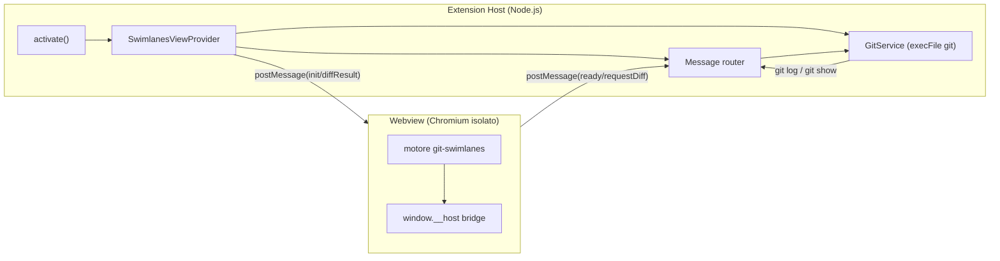
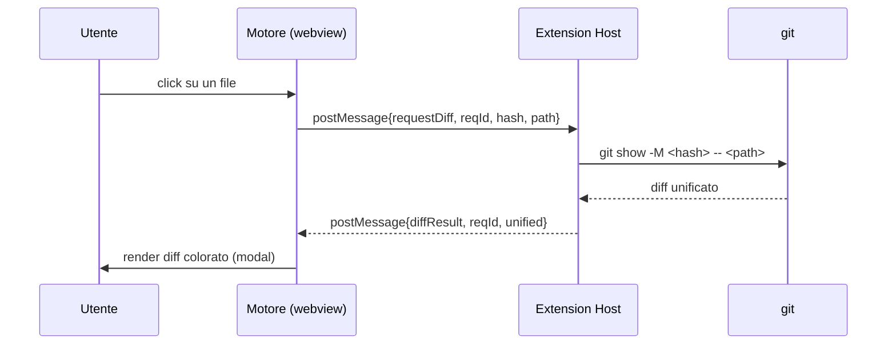

# Git Swimlanes — Specifica plugin **Visual Studio Code**

Specifica esaustiva per incapsulare il visualizzatore deterministico della history Git
(motore `git-swimlanes.html`, vedi `git-swimlanes-spec.md`) in un'estensione VS Code.

> **Separazione delle responsabilità.** Il *motore di visualizzazione* (parsing, corsie,
> colori, rendering SVG, accordion, diff viewer) è platform-agnostic e vive nella webview.
> Questa estensione è solo il **guscio host**: crea la webview, le fornisce i dati Git,
> e risponde alle richieste di diff. Algoritmi e modello dati: vedi la spec del motore.

---

## 1. Architettura



- L'estensione gira nell'**Extension Host** (processo Node.js), ha accesso a filesystem e processi.
- La **webview** è un iframe Chromium isolato: nessun accesso a Node, comunica solo via `postMessage`.
- Il ponte è bidirezionale e asincrono; le richieste di diff sono correlate da un `reqId`.

---

## 2. Contratto di messaggi (host ↔ webview)

Identico a quello della spec IntelliJ: un solo protocollo, due trasporti.

```ts
// ---- Webview -> Host ----
type Wv2Host =
  | { type: "ready" }
  | { type: "requestDiff"; reqId: string; hash: string; path: string; oldPath?: string }
  | { type: "commitSelected"; hash: string }
  | { type: "openFile"; path: string; hash: string };

// ---- Host -> Webview ----
type Host2Wv =
  | { type: "init"; commits: CommitNode[]; theme: Theme }
  | { type: "setLog"; log: string }                       // alternativa a "init"
  | { type: "diffResult"; reqId: string; unified: string }
  | { type: "diffError"; reqId: string; message: string }
  | { type: "theme"; theme: Theme };
```

Superficie che il **motore** espone nella webview (uguale su entrambe le piattaforme):

```ts
// installata dall'host PRIMA del primo messaggio
window.__host = { post(msg: Wv2Host): void };
// invocata dall'host per consegnare messaggi in ingresso
window.GitSwimlanes.receive(msg: Host2Wv): void;
```

---

## 3. Scaffold del progetto

```
git-swimlanes-vscode/
├── package.json
├── tsconfig.json
├── src/
│   ├── extension.ts            # activate/deactivate, registrazioni
│   ├── SwimlanesViewProvider.ts# WebviewViewProvider + router messaggi
│   ├── GitService.ts           # esecuzione git (log/show)
│   └── html.ts                 # generazione HTML webview (CSP + nonce)
├── media/
│   ├── engine.js               # motore git-swimlanes (bundle JS)
│   ├── engine.css
│   └── bridge.js               # window.__host via acquireVsCodeApi()
└── .vscodeignore
```

### 3.1 `package.json` (estratto contributi)

```jsonc
{
  "name": "git-swimlanes",
  "displayName": "Git Swimlanes",
  "engines": { "vscode": "^1.85.0" },
  "categories": ["SCM Providers", "Visualization"],
  "activationEvents": [],
  "main": "./dist/extension.js",
  "contributes": {
    "viewsContainers": {
      "activitybar": [
        { "id": "gitSwimlanes", "title": "Git Swimlanes", "icon": "media/icon.svg" }
      ]
    },
    "views": {
      "gitSwimlanes": [
        { "type": "webview", "id": "gitSwimlanes.graph", "name": "History" }
      ]
    },
    "commands": [
      { "command": "gitSwimlanes.refresh", "title": "Git Swimlanes: Refresh", "icon": "$(refresh)" },
      { "command": "gitSwimlanes.openPanel", "title": "Git Swimlanes: Open in Editor" }
    ],
    "menus": {
      "view/title": [
        { "command": "gitSwimlanes.refresh", "when": "view == gitSwimlanes.graph", "group": "navigation" }
      ]
    }
  }
}
```

> La view è di `"type": "webview"`: VS Code la collega a un `WebviewViewProvider`
> registrato con lo stesso `id`.

---

## 4. Hosting della webview

### 4.1 Provider della view (sidebar)

```ts
// SwimlanesViewProvider.ts
import * as vscode from "vscode";
import { GitService } from "./GitService";
import { buildHtml } from "./html";

export class SwimlanesViewProvider implements vscode.WebviewViewProvider {
  public static readonly viewId = "gitSwimlanes.graph";
  private view?: vscode.WebviewView;

  constructor(
    private readonly ctx: vscode.ExtensionContext,
    private readonly git: GitService
  ) {}

  resolveWebviewView(view: vscode.WebviewView) {
    this.view = view;
    view.webview.options = {
      enableScripts: true,
      localResourceRoots: [vscode.Uri.joinPath(this.ctx.extensionUri, "media")],
    };
    view.webview.html = buildHtml(view.webview, this.ctx.extensionUri);

    view.webview.onDidReceiveMessage((msg) => this.onMessage(msg));

    // refresh quando la view torna visibile
    view.onDidChangeVisibility(() => view.visible && this.refresh());
  }

  /** Carica il log e inizializza il motore. */
  async refresh() {
    if (!this.view) return;
    try {
      const log = await this.git.log();
      this.post({ type: "setLog", log });
      this.post({ type: "theme", theme: currentTheme() });
    } catch (e: any) {
      this.post({ type: "diffError", reqId: "*", message: String(e?.message ?? e) });
    }
  }

  private async onMessage(msg: Wv2Host) {
    switch (msg.type) {
      case "ready":
        await this.refresh();
        break;
      case "requestDiff":
        try {
          const unified = await this.git.show(msg.hash, msg.path);
          this.post({ type: "diffResult", reqId: msg.reqId, unified });
        } catch (e: any) {
          this.post({ type: "diffError", reqId: msg.reqId, message: String(e?.message ?? e) });
        }
        break;
      case "openFile":
        const uri = vscode.Uri.file(/* repoRoot + */ msg.path);
        await vscode.window.showTextDocument(uri);
        break;
    }
  }

  private post(msg: Host2Wv) { this.view?.webview.postMessage(msg); }
}
```

### 4.2 Generazione HTML con CSP + nonce

Le webview VS Code richiedono **Content Security Policy** stretta e URI riscritti via
`asWebviewUri`. Gli script inline devono portare un `nonce`.

```ts
// html.ts
import * as vscode from "vscode";

export function buildHtml(webview: vscode.Webview, root: vscode.Uri): string {
  const nonce = makeNonce();
  const uri = (p: string) =>
    webview.asWebviewUri(vscode.Uri.joinPath(root, "media", p));

  return /* html */ `<!DOCTYPE html>
<html lang="it">
<head>
<meta charset="utf-8">
<meta http-equiv="Content-Security-Policy" content="
  default-src 'none';
  img-src ${webview.cspSource} data:;
  style-src ${webview.cspSource} 'unsafe-inline';
  font-src ${webview.cspSource};
  script-src 'nonce-${nonce}';">
<link rel="stylesheet" href="${uri("engine.css")}">
</head>
<body>
  <div id="app"></div>
  <script nonce="${nonce}" src="${uri("engine.js")}"></script>
  <script nonce="${nonce}" src="${uri("bridge.js")}"></script>
</body>
</html>`;
}

function makeNonce() {
  return Array.from({ length: 32 }, () =>
    "ABCDEFGHIJKLMNOPQRSTUVWXYZabcdefghijklmnopqrstuvwxyz0123456789"[
      Math.floor(Math.random() * 62)
    ]).join("");
}
```

### 4.3 Ponte nella webview (`media/bridge.js`)

```js
// trasporto VS Code: postMessage in entrambi i versi
const vscode = acquireVsCodeApi();
window.__host = { post: (msg) => vscode.postMessage(msg) };
window.addEventListener("message", (e) => window.GitSwimlanes.receive(e.data));
// segnala al host che il motore è pronto a ricevere "init/setLog"
window.GitSwimlanes.onReady = () => window.__host.post({ type: "ready" });
```

> Il motore (`engine.js`) usa **solo** `window.__host.post(...)` per uscire e riceve da
> `window.GitSwimlanes.receive(...)`. Lo stesso bundle gira invariato sotto IntelliJ:
> cambia solo questo file ponte.

---

## 5. GitService — acquisizione dati

VS Code può individuare il repo tramite l'estensione Git integrata, ma per leggere il log
con il formato richiesto conviene eseguire `git` direttamente (controllo totale, niente shell).

```ts
// GitService.ts
import { execFile } from "node:child_process";
import { promisify } from "node:util";
import * as vscode from "vscode";
const run = promisify(execFile);

const LOG_ARGS = [
  "-c", "core.quotepath=false", "--no-pager", "log",
  "--all", "--date-order", "--name-status",
  "--pretty=format:%H|%P|%D|%an|%ad|%s", "--date=short",
];

export class GitService {
  constructor(private cwd: string) {}

  /** Radice del repo via estensione Git integrata (fallback: workspace). */
  static async resolveRepoRoot(): Promise<string | undefined> {
    const gitExt = vscode.extensions.getExtension<any>("vscode.git");
    const api = gitExt?.isActive ? gitExt.exports.getAPI(1)
                                 : (await gitExt?.activate())?.getAPI(1);
    const repo = api?.repositories?.[0];
    return repo?.rootUri?.fsPath
        ?? vscode.workspace.workspaceFolders?.[0]?.uri.fsPath;
  }

  async log(): Promise<string> {
    const { stdout } = await run("git", LOG_ARGS, {
      cwd: this.cwd, maxBuffer: 64 * 1024 * 1024,
    });
    return stdout;
  }

  async show(hash: string, path: string): Promise<string> {
    if (!/^[0-9a-f]{7,40}$/.test(hash)) throw new Error("hash non valido");
    const { stdout } = await run("git", ["show", "-M", hash, "--", path], {
      cwd: this.cwd, maxBuffer: 32 * 1024 * 1024,
    });
    return stdout;
  }
}
```

> **Sicurezza.** `execFile` non passa da una shell → niente injection. L'hash è validato con
> regex; il path è argomento separato dopo `--`. Limitare `maxBuffer` per diff giganti.

### 5.1 Refresh automatico sui commit

L'API Git integrata espone lo stato del repo; ascoltarne i cambi per ricaricare:

```ts
const api = /* getAPI(1) come sopra */;
const repo = api.repositories[0];
repo.state.onDidChange(() => provider.refresh());
```

---

## 6. Diff on-click — sequenza completa



Lato motore, il viewer integrato (modal con classificazione `add/del/hunk/meta`)
è già pronto: l'host deve solo restituire `unified`. Il `reqId` evita race se l'utente
apre più diff in rapida successione.

---

## 7. Attivazione e comandi

```ts
// extension.ts
import * as vscode from "vscode";
import { GitService } from "./GitService";
import { SwimlanesViewProvider } from "./SwimlanesViewProvider";

export async function activate(ctx: vscode.ExtensionContext) {
  const root = await GitService.resolveRepoRoot();
  if (!root) { vscode.window.showWarningMessage("Nessun repository Git trovato."); return; }

  const git = new GitService(root);
  const provider = new SwimlanesViewProvider(ctx, git);

  ctx.subscriptions.push(
    vscode.window.registerWebviewViewProvider(SwimlanesViewProvider.viewId, provider),
    vscode.commands.registerCommand("gitSwimlanes.refresh", () => provider.refresh()),
  );

  // re-tema quando l'utente cambia tema IDE
  ctx.subscriptions.push(
    vscode.window.onDidChangeActiveColorTheme(() =>
      provider.post({ type: "theme", theme: currentTheme() })),
  );
}

export function deactivate() {}
```

---

## 8. Tema — sincronia con l'editor

Due strategie, combinabili:

1. **CSS variables di VS Code** (consigliata): la webview eredita automaticamente
   `--vscode-editor-background`, `--vscode-foreground`, ecc. Mappare i token del motore:

   ```css
   :root {
     --bg:    var(--vscode-editor-background);
     --txt:   var(--vscode-foreground);
     --line:  var(--vscode-panel-border);
     --accent:var(--vscode-textLink-foreground);
   }
   ```

2. **Messaggio `theme`**: per i colori delle corsie (derivati dal nome) basta regolare
   `laneLightness` in base a chiaro/scuro:

   ```ts
   function currentTheme(): Theme {
     const dark = vscode.window.activeColorTheme.kind === vscode.ColorThemeKind.Dark;
     return { laneSaturation: 68, laneLightness: dark ? 60 : 45 };
   }
   ```

VS Code aggiunge anche la classe `vscode-dark` / `vscode-light` / `vscode-high-contrast`
al `<body>`: utile per ritocchi CSS condizionali.

---

## 9. Lifecycle, performance, stato

- **Persistenza UI**: `webview.getState()/setState()` per ricordare quali accordion erano
  aperti tra un nascondi/mostra della view (le webview vengono distrutte quando non visibili,
  a meno di `retainContextWhenHidden: true` — costoso: usarlo solo se necessario).
- **Disposizione**: tutto va in `ctx.subscriptions` (auto-dispose alla deattivazione).
- **Repo grandi**: virtualizzare le righe nel motore (vedi spec motore §9); il log enorme va
  trasferito una volta sola e parsato nella webview (eventualmente in un Web Worker).
- **No storage del browser**: in webview non usare `localStorage`; usare `getState/setState`.

---

## 10. Packaging e pubblicazione

```bash
npm i -g @vscode/vsce
vsce package            # produce git-swimlanes-x.y.z.vsix
vsce publish            # Marketplace (richiede publisher + PAT)
```

`.vscodeignore` deve escludere `src/`, `node_modules` di sviluppo, mantenendo `dist/` e `media/`.
Dichiarare `"capabilities": { "untrustedWorkspaces": { "supported": "limited" } }` se si vuole
funzionare in workspace non fidati (l'esecuzione di `git` richiede cautela: leggere solo).

---

## 11. Casi limite

| Caso | Comportamento |
|---|---|
| Nessun repo nel workspace | warning, view vuota con messaggio |
| Multi-root / più repository | selettore di repo (quick pick) o una view per repo |
| Repo shallow | il motore omette gli archi verso parent assenti; suggerire `git fetch --unshallow` |
| Diff di file binario | `git show` segnala "Binary files differ"; il viewer lo mostra come testo |
| Merge senza file | comportamento Git standard; il motore mostra l'hint `-m --first-parent` |
| Webview ricreata (cambio focus) | su `ready` l'host re-invia `setLog` + stato |

---

## 12. Appendice — checklist d'integrazione

1. Bundle del motore in `media/engine.js` + `engine.css` (output del build del motore).
2. `bridge.js` con `acquireVsCodeApi()` → `window.__host.post` e `receive`.
3. HTML con CSP/nonce via `buildHtml`.
4. `GitService` con `log()` e `show()` (`execFile`, validazione hash).
5. `SwimlanesViewProvider` con router dei messaggi (`ready`/`requestDiff`/`openFile`).
6. Contributi `package.json`: viewsContainer + view webview + comandi/menu.
7. Tema via CSS vars `--vscode-*` + messaggio `theme` per le corsie.
8. `vsce package` → test del `.vsix` → `vsce publish`.

> Comandi Git di riferimento (log, show, shallow check, diff merge): vedi
> `git-swimlanes-spec.md` §11.
